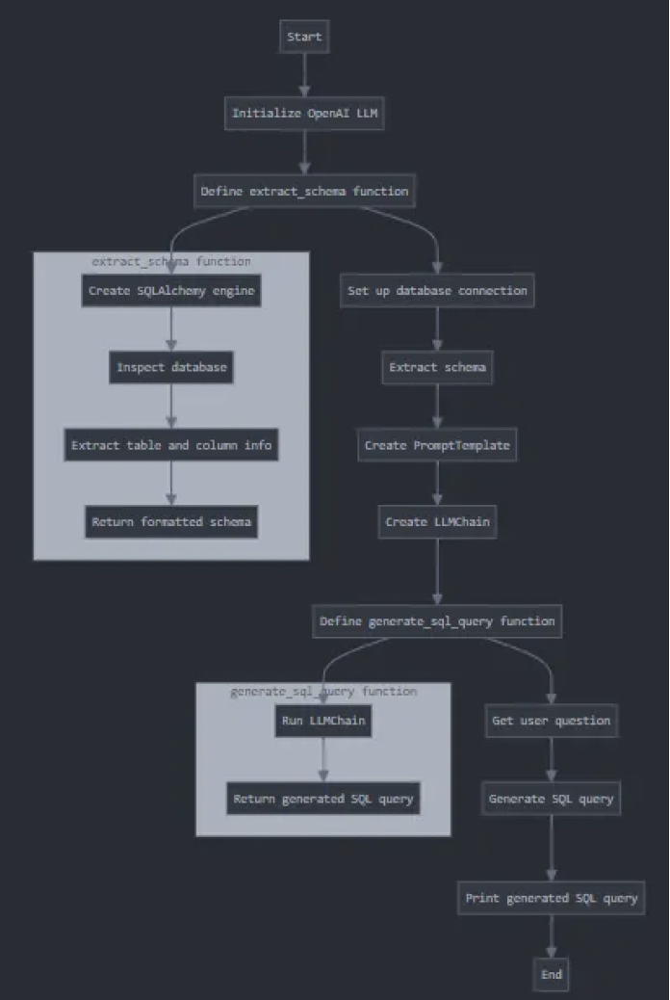

# LangChain Database Schema Interaction

## Overview

This project demonstrates a secure method of generating SQL queries using LangChain and OpenAI's language models, based on a database schema rather than direct database access. This approach enhances security by working with the structure of the database without exposing actual data to the language model.

## Features

- Extracts database schema without accessing data
- Generates SQL queries using natural language processing
- Utilizes OpenAI's language models via LangChain
- Provides a layer of abstraction between the query generator and the actual database

## Requirements

- Python 3.7+
- OpenAI API key
- LangChain
- SQLAlchemy
- A SQL database (SQLite used in this example)

## Usage

1. Run the main script:
   ```
   streamlit run app.py
   ```

2. The script will start the streamlit applicaltion on your local server

3. To generate queries for your own questions, upload the Database or use sample one and then write your query:
   
## How It Works


1. **Schema Extraction**: The script connects to the database and extracts its schema (table names and column details) without accessing the actual data.

2. **Query Generation**: Using LangChain and OpenAI's language model, the script generates SQL queries based on the extracted schema and natural language questions.

3. **Security**: By working with the schema instead of the actual database, this approach adds a layer of security, preventing direct data access during query generation.

## Customization

- Modify the `prompt_template` to adjust how the AI generates SQL queries.
- Extend the `extract_schema` function to include more detailed schema information if needed.

## Important Notes

- This script generates SQL queries but does not execute them. Implement proper security measures before executing generated queries on a real database.
- Always review and validate generated SQL queries before execution to ensure they meet your security and performance requirements.
- Keep your OpenAI API key secure and do not share it in your code repository.

## Contributing

Contributions to improve the functionality, security, or efficiency of this project are welcome. Please submit a pull request or open an issue to discuss proposed changes.


## Disclaimer

This project is a demonstration and should be carefully reviewed and adapted before use in any production environment. Always prioritize security and data privacy when working with databases and language models.
